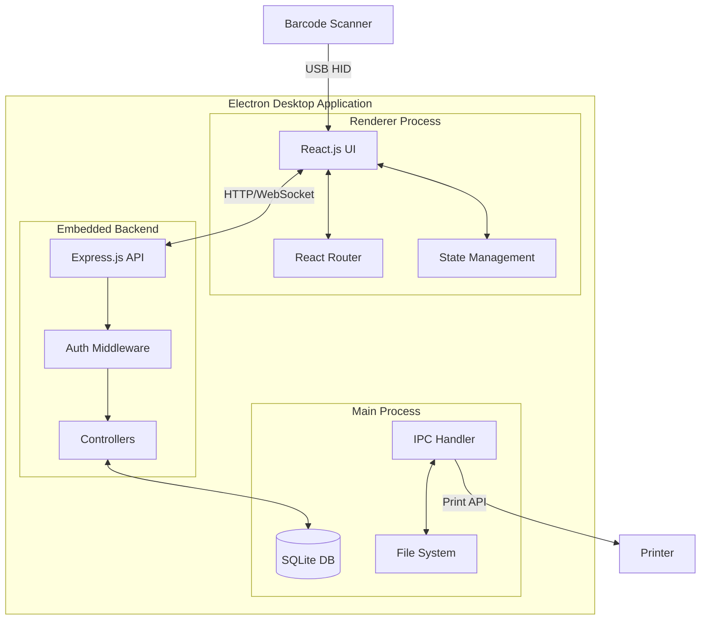
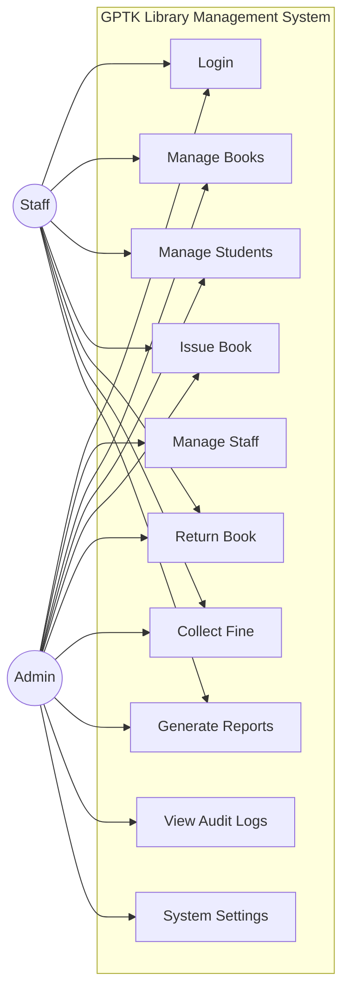
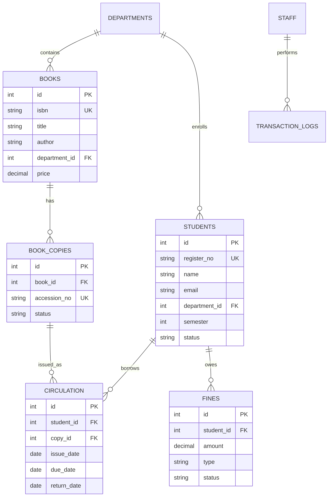
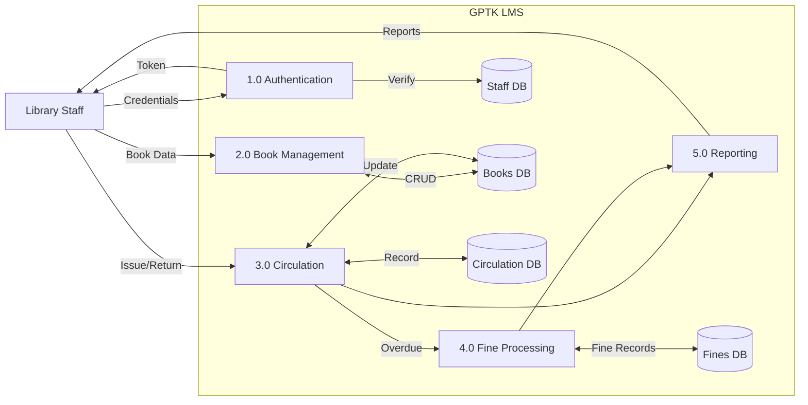

# Continuous Internal Evaluation - CIE - II conducted at the end of 8th week

| Sl No | Assessment of parameter | Marks |
|:-----:|-------------------------|:-----:|
| 1 | **Capstone project Details**: | 80 |
|   | • Description of Technology Used | |
|   | • Details of Hardware devices | |
|   | • Details of software products | |
|   | • Programming languages | |
|   | • Descriptions of the components in the system | |
|   | • Component diagrams and required design if any | |
|   | • Construction or Fabrication details | |
|   | • Any other information needed to execute the capstone project | |
|   | **Total** | **80** |

---

## 1. Description of Technology Used

### 1.1 Technology Stack Overview

The GPTK Library Management System is built using a modern, full-stack JavaScript technology stack optimized for desktop application development with complete offline functionality.

| Layer | Technology | Version | Purpose |
|-------|------------|---------|---------|
| **Desktop Container** | Electron.js | 40.x | Cross-platform desktop wrapper |
| **Frontend** | React.js | 18.x | Component-based UI framework |
| **Backend** | Node.js | 20.x LTS | JavaScript runtime |
| **API Framework** | Express.js | 4.x | RESTful API development |
| **Database** | SQLite3 | 3.x | Embedded local database |
| **Real-time** | Socket.io | 4.x | WebSocket communication |
| **Styling** | CSS Variables | - | Theming and design system |

### 1.2 Architecture Pattern

```
┌────────────────────────────────────────────────────────────┐
│                    ELECTRON MAIN PROCESS                    │
│  ┌──────────────────────────────────────────────────────┐  │
│  │                   Node.js Backend                     │  │
│  │  ┌─────────┐ ┌─────────┐ ┌─────────┐ ┌─────────┐    │  │
│  │  │  Auth   │ │  Books  │ │Students │ │  Fines  │    │  │
│  │  └─────────┘ └─────────┘ └─────────┘ └─────────┘    │  │
│  │                    ↓ SQLite3 ↓                        │  │
│  │              ┌─────────────────┐                      │  │
│  │              │  Local Database │                      │  │
│  │              └─────────────────┘                      │  │
│  └──────────────────────────────────────────────────────┘  │
│                          ↕ IPC                              │
│  ┌──────────────────────────────────────────────────────┐  │
│  │              ELECTRON RENDERER PROCESS                │  │
│  │                    React.js UI                        │  │
│  └──────────────────────────────────────────────────────┘  │
└────────────────────────────────────────────────────────────┘
```

### 1.3 Why This Technology Stack?

| Technology | Justification |
|------------|---------------|
| **Electron.js** | Enables building cross-platform desktop apps using web technologies; provides native OS integration for file system, printing, and hardware access |
| **React.js** | Component-based architecture allows modular UI development; virtual DOM ensures efficient rendering |
| **Node.js** | Unified JavaScript across frontend and backend; large npm ecosystem; excellent for I/O operations |
| **SQLite** | Zero-configuration embedded database; perfect for offline-first applications; no separate server required |
| **Socket.io** | Real-time bidirectional communication for live dashboard updates and notifications |

---

## 2. Details of Hardware Devices

### 2.1 Development Hardware

| Component | Specification | Purpose |
|-----------|---------------|---------|
| **Processor** | Intel Core i5 / AMD Ryzen 5 or higher | Running Electron app and development tools |
| **RAM** | Minimum 8 GB (16 GB recommended) | Smooth development and testing |
| **Storage** | 256 GB SSD or higher | Fast read/write for database operations |
| **Display** | 1366×768 minimum (1920×1080 recommended) | UI development and testing |
| **OS** | Windows 10/11 (64-bit) | Target deployment platform |

### 2.2 Deployment Hardware (Library Counter)

| Component | Minimum Requirement | Recommended |
|-----------|---------------------|-------------|
| **Processor** | Intel Core i3 / AMD Ryzen 3 | Intel Core i5 |
| **RAM** | 4 GB | 8 GB |
| **Storage** | 128 GB HDD/SSD | 256 GB SSD |
| **Display** | 1280×720 | 1366×768 or higher |

### 2.3 Peripheral Hardware Integration

| Device | Model/Type | Interface | Purpose |
|--------|------------|-----------|---------|
| **Barcode Scanner** | USB HID Scanner (Honeywell/Zebra) | USB Keyboard Emulation | Book and student ID scanning |
| **Thermal Printer** | 58mm/80mm ESC/POS Printer | USB/Serial | Receipt printing |
| **A4 Printer** | Standard Laser/Inkjet | USB/Network | Report printing, ID cards |

### 2.4 Barcode Scanner Integration

The system supports USB HID barcode scanners that emulate keyboard input:

```
Scanner Input Flow:
┌──────────────┐    ┌──────────────┐    ┌──────────────┐
│   Scan       │───▶│  Keyboard    │───▶│   React      │
│   Barcode    │    │   Buffer     │    │   Handler    │
└──────────────┘    └──────────────┘    └──────────────┘
                                               │
                                               ▼
                                        ┌──────────────┐
                                        │  Process     │
                                        │  ISBN/RegNo  │
                                        └──────────────┘
```

---

## 3. Details of Software Products

### 3.1 Development Tools

| Software | Version | Purpose |
|----------|---------|---------|
| **Visual Studio Code** | Latest | Primary IDE for development |
| **Node.js** | 20.x LTS | JavaScript runtime environment |
| **npm** | 10.x | Package manager |
| **Git** | 2.x | Version control |
| **Electron Builder** | 25.x | Application packaging |

### 3.2 Core Dependencies (package.json)

| Package | Version | Purpose |
|---------|---------|---------|
| `electron` | ^40.0.0 | Desktop application framework |
| `react` | ^18.2.0 | UI component library |
| `react-dom` | ^18.2.0 | React DOM rendering |
| `react-router-dom` | ^6.x | Client-side routing |
| `express` | ^4.18.0 | Backend API framework |
| `sqlite3` | ^5.1.0 | Database driver |
| `better-sqlite3` | ^9.x | Synchronous SQLite operations |
| `bcryptjs` | ^2.4.0 | Password hashing |
| `jsonwebtoken` | ^9.x | JWT authentication |
| `socket.io` | ^4.6.0 | Real-time communication |
| `nodemailer` | ^6.9.0 | Email notifications |
| `jspdf` | ^2.5.0 | PDF generation |
| `xlsx` | ^0.18.0 | Excel export |
| `i18next` | ^25.8.0 | Internationalization |

### 3.3 Development Dependencies

| Package | Purpose |
|---------|---------|
| `electron-builder` | Building and packaging |
| `concurrently` | Running multiple processes |
| `nodemon` | Auto-restart during development |
| `eslint` | Code quality |

---

## 4. Programming Languages

### 4.1 Languages Used

| Language | Usage Area | Percentage |
|----------|------------|------------|
| **JavaScript (ES6+)** | Frontend, Backend, Electron main process | 85% |
| **HTML5** | Page structure, email templates | 5% |
| **CSS3** | Styling, animations, theming | 8% |
| **SQL** | Database queries | 2% |

### 4.2 JavaScript Features Used

| Feature | Usage |
|---------|-------|
| **ES6 Modules** | Import/export for modular code |
| **Async/Await** | Asynchronous database operations |
| **Arrow Functions** | Concise function syntax |
| **Destructuring** | Object and array unpacking |
| **Template Literals** | String interpolation for SQL queries |
| **Spread Operator** | Object merging and array operations |
| **React Hooks** | useState, useEffect, useContext for state management |

### 4.3 Code Example - Authentication Controller

```javascript
// authController.js - JWT-based authentication
const bcrypt = require('bcryptjs');
const jwt = require('jsonwebtoken');

const login = async (req, res) => {
    const { email, password } = req.body;
    
    // Find user in database
    const user = await db.get(
        'SELECT * FROM staff WHERE email = ?', 
        [email]
    );
    
    // Verify password
    const isValid = await bcrypt.compare(password, user.password_hash);
    
    if (isValid) {
        // Generate JWT token
        const token = jwt.sign(
            { id: user.id, role: user.role },
            process.env.JWT_SECRET,
            { expiresIn: '8h' }
        );
        res.json({ token, user });
    }
};
```

---

## 5. Descriptions of the Components in the System

### 5.1 Frontend Components (React.js)

| Component | File | Responsibility |
|-----------|------|----------------|
| **LoginPage** | `LoginPage.js` | User authentication UI |
| **DashboardHome** | `DashboardHome.js` | KPI cards, charts, real-time stats |
| **CatalogPage** | `CatalogPage.js` | Book inventory management |
| **StudentManager** | `StudentManager.js` | Student database CRUD |
| **CirculationPage** | `CirculationPage.js` | Issue/Return/Renew operations |
| **FineManagementPage** | `FineManagementPage.js` | Fine collection and waivers |
| **ReportsPage** | `ReportsPage.js` | Analytics and exports |
| **AuditPage** | `AuditPage.js` | System activity logs |
| **SettingsPage** | `SettingsPage.js` | System configuration |

### 5.2 Backend Controllers (Node.js/Express)

| Controller | File | API Endpoints |
|------------|------|---------------|
| **Auth** | `authController.js` | `/api/auth/login`, `/api/auth/logout` |
| **Books** | `bookController.js` | `/api/books`, `/api/books/:id` |
| **Students** | `studentController.js` | `/api/students`, `/api/students/:id` |
| **Circulation** | `circulationHandler.js` | `/api/circulation/issue`, `/api/circulation/return` |
| **Fines** | `fineController.js` | `/api/fines`, `/api/fines/pay` |
| **Reports** | `reportsController.js` | `/api/reports/daily`, `/api/reports/monthly` |
| **Audit** | `auditController.js` | `/api/audit/logs` |
| **Dashboard** | `dashboardController.js` | `/api/dashboard/stats` |

### 5.3 Database Schema

| Table | Purpose | Key Fields |
|-------|---------|------------|
| `admins` | Administrator accounts | id, email, password_hash, role |
| `staff` | Library staff accounts | id, name, email, permissions |
| `students` | Student database | id, register_no, name, department, semester |
| `departments` | Academic departments | id, name, code, hod_signature |
| `books` | Book catalog | id, isbn, title, author, department_id |
| `book_copies` | Physical copies | id, book_id, accession_no, status |
| `circulation` | Active loans | id, student_id, copy_id, issue_date, due_date |
| `fines` | Financial records | id, student_id, amount, status, type |
| `transaction_logs` | History | id, type, student_id, book_id, timestamp |
| `audit_logs` | System activity | id, actor, action, module, timestamp |
| `settings` | Configuration | key, value |

---

## 6. Component Diagrams and Required Design

### 6.1 System Architecture Diagram



### 6.2 Use Case Diagram



### 6.3 Entity Relationship Diagram



### 6.4 Data Flow Diagram (Level 1)



---

## 7. Construction or Fabrication Details

### 7.1 Project Structure

```
GPTK Library Management System/
├── backend/
│   ├── controllers/          # API controllers
│   │   ├── authController.js
│   │   ├── bookController.js
│   │   ├── studentController.js
│   │   ├── circulationHandler.js
│   │   ├── fineController.js
│   │   └── reportsController.js
│   ├── middleware/           # Auth middleware
│   ├── routes/               # API routes
│   ├── database/             # SQLite database
│   └── server.js             # Express server
├── frontend/
│   ├── src/
│   │   ├── components/       # Reusable UI components
│   │   ├── pages/            # Page components
│   │   ├── context/          # React context
│   │   ├── hooks/            # Custom hooks
│   │   ├── translations/     # i18n (en, kn)
│   │   └── App.js            # Main app
│   └── public/               # Static assets
├── electron/
│   ├── main.js               # Electron main process
│   └── preload.js            # Preload scripts
├── Docs/                     # Documentation
└── package.json              # Dependencies
```

### 7.2 Build Process

| Step | Command | Output |
|------|---------|--------|
| 1. Install Dependencies | `npm install` | node_modules/ |
| 2. Start Development | `npm run dev` | Local server + Electron |
| 3. Build Frontend | `npm run build:frontend` | dist/ folder |
| 4. Package Desktop | `npm run build:electron` | .exe installer |

### 7.3 Database Initialization

```sql
-- Core tables creation
CREATE TABLE IF NOT EXISTS students (
    id INTEGER PRIMARY KEY AUTOINCREMENT,
    register_no TEXT UNIQUE NOT NULL,
    name TEXT NOT NULL,
    email TEXT,
    department_id INTEGER REFERENCES departments(id),
    semester INTEGER DEFAULT 1,
    status TEXT DEFAULT 'Active',
    created_at DATETIME DEFAULT CURRENT_TIMESTAMP
);

CREATE TABLE IF NOT EXISTS books (
    id INTEGER PRIMARY KEY AUTOINCREMENT,
    isbn TEXT UNIQUE NOT NULL,
    title TEXT NOT NULL,
    author TEXT,
    publisher TEXT,
    department_id INTEGER REFERENCES departments(id),
    price REAL DEFAULT 0,
    total_copies INTEGER DEFAULT 1,
    created_at DATETIME DEFAULT CURRENT_TIMESTAMP
);

CREATE TABLE IF NOT EXISTS circulation (
    id INTEGER PRIMARY KEY AUTOINCREMENT,
    student_id INTEGER REFERENCES students(id),
    copy_id INTEGER REFERENCES book_copies(id),
    issue_date DATE DEFAULT CURRENT_DATE,
    due_date DATE NOT NULL,
    return_date DATE,
    status TEXT DEFAULT 'Active',
    performed_by INTEGER REFERENCES staff(id)
);
```

---

## 8. Additional Information for Project Execution

### 8.1 Security Implementation

| Feature | Implementation |
|---------|----------------|
| **Password Hashing** | bcrypt with salt rounds of 10 |
| **Authentication** | JWT tokens with 8-hour expiry |
| **Authorization** | Role-Based Access Control (RBAC) |
| **Session Management** | localStorage for tokens |
| **API Security** | Auth middleware on all protected routes |

### 8.2 Offline Functionality

The system is designed to work 100% offline:
- SQLite database stored locally
- No external API dependencies for core operations
- Optional cloud sync for backups only
- Email notifications require internet (optional feature)

### 8.3 Data Backup Strategy

| Backup Type | Frequency | Location |
|-------------|-----------|----------|
| **Auto Local Backup** | On app close | AppData/backups/ |
| **Manual Backup** | On demand | User-selected folder |
| **Cloud Sync** | Daily (if enabled) | MongoDB Atlas |

### 8.4 Performance Optimizations

| Optimization | Implementation |
|--------------|----------------|
| **Database Indexing** | Indexes on frequently queried columns |
| **WAL Mode** | SQLite Write-Ahead Logging for crash recovery |
| **Lazy Loading** | Components loaded on demand |
| **Debounced Search** | Prevents excessive database queries |
| **Connection Pooling** | Efficient database connections |

### 8.5 Accessibility Features

| Feature | Description |
|---------|-------------|
| **High Contrast Mode** | Enhanced visibility for visually impaired users |
| **Font Scaling** | Adjustable font size (85% - 130%) |
| **Keyboard Navigation** | Full support for keyboard-only operation |
| **Function Keys** | F1 (Issue), F2 (Return), F3 (Renew) shortcuts |
| **Bilingual Support** | English and Kannada (kn) translations |

### 8.6 Deployment Checklist

- [ ] Install Node.js 20.x LTS
- [ ] Clone/Copy project folder
- [ ] Run `npm install` to install dependencies
- [ ] Configure environment variables (.env)
- [ ] Initialize database with seed data
- [ ] Run `npm run build` for production build
- [ ] Create installer using `npm run package`
- [ ] Install on target machine
- [ ] Connect barcode scanner (USB)
- [ ] Configure printer settings
- [ ] Create admin account
- [ ] Train library staff

---

## Summary

This CIE-II document provides comprehensive technical details of the GPTK Library Management System including:
- Modern JavaScript technology stack (Electron, React, Node.js, SQLite)
- Hardware requirements for development and deployment
- Software dependencies and tools
- Programming languages with code examples
- System components with clear responsibilities
- Multiple diagrams (Architecture, Use Case, ER, DFD)
- Construction details with project structure
- Additional execution information (security, backup, performance)

The system is designed as a **modular, offline-first desktop application** that can be easily deployed in any educational institution with minimal infrastructure requirements.
