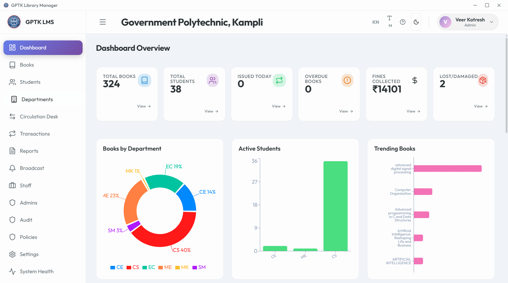
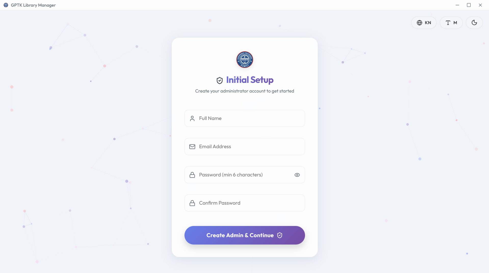
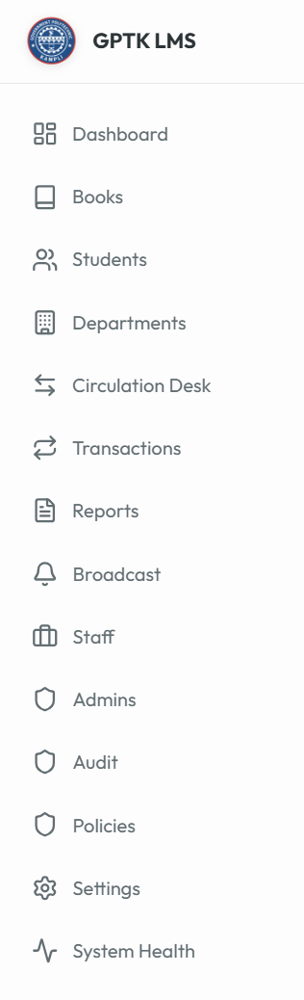
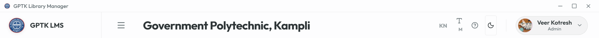

# GPTK Library Management System - User Manual v1.0

## 1. Introduction
### Welcome to GPTK Library Management System
The **GPTK Library Management System (LMS)** is a state-of-the-art desktop application meticulously designed to digitize and automate the entire workflow of the Government Polytechnic Kampli library. Built for speed, reliability, and ease of use, it transforms traditional library operations into a seamless digital experience.

> **Release 1.0:** Now featuring a completely redesigned interface with dark mode support, enhanced reporting analytics, and automated student data imports.

#### Core Capabilities
Designed to serve librarians, faculty, and students, the system integrates five key pillars of library management:
*   **Catalog Management:** A powerful search and inventory system for thousands of books.
*   **Smart Circulation:** Lightning-fast issue/return process using barcode scanning or manual entry.
*   **Member Administration:** Comprehensive student and staff databases with digital ID card generation.
*   **Financial Tracking:** Automated fine calculation, due date management, and transaction logging.
*   **Actionable Insights:** Real-time dashboards and detailed PDF/Excel reports for decision-making.

#### Navigating the System
The interface is divided into two main areas for maximum productivity:
*   **The Sidebar:** Located on the left, this is your primary navigation menu to access different modules like Books, Students, and Settings.
*   **The Dashboard:** Your home screen, displaying vital statistics like total books, active issues, and overdue alerts at a glance.


*Figure 1.1: Main Dashboard with Key Performance Indicators*

---

## 2. Authentication
### Smart Authentication & Security
The system employs extensive security protocols to ensure that sensitive library data remains protected while offering seamless access to authorized personnel.

> **Security Note:** The application uses industry-standard encryption for passwords and maintains a secure, local-first database environment.

#### 1. Intelligent Role-Based Login
Access is strictly controlled through a **Role-Based Access Control (RBAC)** system. Your dashboard experience automatically adapts based on your assigned credentials:
*   **Admins:** Full system control including settings, staff management, and audit logs.
*   **Staff:** Operational access for circulation and member management, restricted from critical system configs.
*   **Librarians:** Dedicated view for cataloging and day-to-day library operations.


*Figure 2.1: Secure Login Interface*

**Smart Login Features:**
*   **Account Locking:** Prevents brute-force attacks by locking accounts after multiple failed attempts.
*   **Show/Hide Password:** Toggle visibility to prevent typing errors.
*   **Enter-to-Submit:** Optimized for keyboard-only workflow.

#### 2. OTP-Verified Password Recovery
Forgot your credentials? The system includes a secure, OTP-based recovery mechanism to restore access without admin intervention.

**Recovery Flow:**
1.  Click **Forgot Password?** on the login screen.
2.  Enter your registered **Email Address**.
3.  Input the **6-digit OTP** sent to your inbox.
4.  Set a new, **Strong Password**.


*Figure 2.2: Secure Password Reset Flow*

---

## 3. Initial Setup
### System Initialization & First-Run Wizard
Welcome to the GPTK Library Management System. Upon first launch, the application initiates a comprehensive **System Health Check** and guides you through the essential configuration steps to prepare the database for production use.

> **Network Requirement:** Ensure you are connected to the internet during initial setup to allowing fetching of metadata and updates.

#### 1. Database Configuration
The system automatically initializes the embedded MongoDB environment. No manual database installation is required. Data is stored locally at:
*   **Database:** `./data/db`
*   **Backups:** `./backups`
*   **Logs:** `./logs/app.log`

#### 2. Super Admin Creation
The first user created is granted **Super Admin** privileges. This account has irrevocable access to the entire system and cannot be deleted.


*Figure 3.1: Admin Account Creation*

**Configuration Steps:**
1.  Launch the application via `LibraryManager.exe`.
2.  Enter the unique **Institution ID** (provided upon license purchase).
3.  Create your admin credentials (Username & Password).
4.  **System Handshake:** The app verifies integrity and creates necessary encryption keys.

> **Important:** Do not close the application window during the "Initializing Database..." phase to prevent data corruption.

---

## 4. Dashboard
### The Dashboard & Navigation Hub
The Dashboard serves as the command center of the GPTK Library Management System, offering a real-time panoramic view of library operations and instant access to all modules.

#### Sidebar Navigation
An intuitive, collapsible vertical menu providing one-click access to:
*   **Core Modules:** Books, Students, Departments.
*   **Circulation Desk:** Issue, Return, and Renewals.
*   **Admin Tools:** Staff, Settings, Audit Logs.
*   **Analytics:** Daily Reports and Trends.

> **Pro Tip:** Click the library logo at the top-left to instantly return to the Dashboard from any screen.


*Figure 4.1: Navigation Sidebar*

#### Real-Time Analytics Cards
Live data widgets that pulse with activity:
*   **Total Books:** Current count of distinct titles in the catalog.
*   **Active Issues:** Number of books currently out on loan.
*   **Circulation Velocity:** Books issued in the last 24 hours.
*   **Overdue Alerts:** Critical count of books past their due date.


*Figure 4.2: Real-time Dashboard Analytics*

---

## 5. Header & Settings
### Global Controls
The top navigation bar persists across all screens, offering quick access to personal preferences and system-wide toggles.


*Figure 5.1: Application Header*

*   **Language Switcher:** Toggle between English and Kannada interfaces instantly.
*   **Font Sizer:** Increase/Decrease text size for accessibility.
*   **Theme Toggle:** Switch between Light and Dark modes.
*   **Profile Menu:** Access account settings or Logout safely.

---

## 6. Book Catalog
### The Knowledge Repository
The **Book Catalog** is the heart of the library. It is designed to handle thousands of records with sub-millisecond search retrieval.

#### 1. The Catalog Dashboard
View, sort, and manage your entire collection in a tabular grid.


*Figure 6.1: Master Catalog View*

*   **Smart Search:** Find books by Title, Author, Publisher, or ISBN.
*   **Advanced Filters:** Drill down by Category, Language, or Availability status.
*   **Quick Actions:** Edit, Delete, or View Details for any row.

#### 2. Adding New Titles
Expand your library with a streamlined entry process.

**Method A: Manual Entry**
1.  Click **Add New Book**.
2.  **Scan ISBN:** Use a handheld scanner to auto-fill metadata.
3.  Enter details: Title, Author, Publisher, Price, etc.
4.  Assign a **Category** and Shelf Location.


*Figure 6.2: Book Entry Form*

**Method B: Bulk Import (CSV)**
Migrating from an old system? Import thousands of records in seconds.

*   **Template:** Download the pre-formatted CSV template.
*   **Validation:** The system pre-checks for duplicate ISBNs before import.
*   **CSV Format:** Ensure headers match: `Title`, `Author`, `ISBN`, `Publisher`, `Price`, `Category`, `Copies`.


*Figure 6.3: Bulk Import Tool*

#### 3. Lifecycle Management
**Book Details**
View complete history, including current borrower and past circulation stats.


**Managing Copies**
Track individual physical copies of the same title, each with a unique accession number.


---

## 7. Student Management
### Member Administration
Manage the entire student lifecycle, from admission to alumni status. The centralized directory links students to their transaction history.

#### 1. Student Directory
A searchable database of all registered library members.


*Figure 7.1: Student Directory*

#### 2. Registration
**New Student Entry**
1.  Click **Add Student**.
2.  **Personal Data:** Name, DOB, Gender.
3.  **Academic Data:** Department, Register No (USN), Semester.
4.  **Contact:** Email and Mobile for notifications.


*Figure 7.2: Student Registration*

**Bulk Import (CSV)**
Upload entire class lists using the bulk import tool. The system intelligently maps columns and highlights errors.

> **CSV Headers:** Required columns: `Name`, `Register Number`, `Department`, `Semester`, `Email`, `Mobile`.


#### 3. Digital ID Cards
The system automatically generates printable ID cards with barcodes.


*Figure 7.3: Auto-generated ID Card*

#### 4. Profile Management
Inspect comprehensive student profiles, including current loans, fine history, and personal details.


#### 5. Export Data
Export student lists for administrative use or ID card printing vendors.


---

## 8. Department Management
### Organization & Hierarchy
Organize standard academic departments (e.g., Computer Science, Civil Engineering) to group students and analyze departmental usage trends.


*Figure 8.1: Department List*

---

## 9. Circulation Desk
### The Transaction Core
The Circulation Desk is designed for high-speed counter operations.

#### 1. Issue Books (Check-out)
1.  **Select Student:** Scan Student ID or search by Name/USN.
2.  **Scan Book:** Scan the book's barcode.
3.  **Confirm Issue:** The system verifies eligibility (max books, existing fines) and approves the loan.


*Figure 9.1: Issue Workflow*

#### 2. Return Books (Check-in)
1.  Click **Return Book**.
2.  **Scan Book:** Simply scan the returning book.
3.  **Fine Check:** The system automatically calculates overdue fines if applicable.
4.  **Complete:** The book is marked available instantly.


*Figure 9.2: Return Workflow*

#### 3. Renewals
Extend the loan period for a student if the book is not reserved by others.


---

## 10. Transactions
### Historical Records
A complete audit trail of every issue, return, and renewal event. Filtering allows you to find specific history for any book or student.


*Figure 10.1: Transaction Log*

---

## 11. Reports & Analytics
### Data-Driven Insights
Generate professional reports to understand library usage and inventory value.

#### 1. Graphical Analysis
Visual charts showing:
*   **Most Popular Books:** Top circulated titles.
*   **Department Activity:** Which departments use the library most.
*   **Fine Collections:** Revenue tracked over time.

#### 2. Exportable Reports
Generate detailed PDF or Excel sheets for:
*   Circulation Statistics
*   Inventory Valuation
*   Overdue Lists


*Figure 11.1: Analytics Dashboard*


---

## 12. Staff Management
### Library Team
Manage access for librarians and assistants.
*   **Add Staff:** Create accounts with specific roles (Admin/Librarian).
*   **Permissions:** Restrict access to settings or sensitive data.


*Figure 12.1: Staff Management*

---

## 13. Admin Management
### System Controllers
Manage high-level administrators who have full control over the system configuration.


**Creating Admins**


**Managing Credentials**

*Note: The Root Admin cannot be deleted.*

---

## 14. Audit Logs
### Security & Accountability
An immutable record of every critical action. Primary tool for security monitoring.

#### 1. Activity Monitoring
*   **Actor:** Who performed the action.
*   **Action:** What operation (e.g., Deleted Book).
*   **Target:** What record was affected.
*   **Timestamp:** Precise time.


#### 2. Compliance Export
Export full logs for external auditing.


---

## 15. System Policies
### Operational Rules Engine
Define logic governing library operations, from loan limits to fines.

**Circulation Rules**
Set max books per student, loan periods (days), and renewal limits.


**Financial Rules**
Configure fine amounts per day, grace periods, and currency symbols.


---

## 16. System Settings
### Global Configuration Hub
Control center for infrastructure, security, and automation.

#### 1. Appearance
*   **Theme:** Light/Dark Mode.
*   **Language:** English/Kannada.
*   **Scaling:** Font size adjustments.


#### 2. Hardware
Configure barcode scanners and run device health checks.
*   **Scanner Config:** Set your scanner to append an 'Enter' key suffix for auto-submit.
*   **Testing:** Use the built-in diagnostic tool to verify scan speed and accuracy.


#### 3. Security
Change admin passwords and configure session timeouts.


#### 4. Data & Maintenance
Manage backups, cloud connections, and cache clearing.


#### 5. Creating a Cloud Database (MongoDB Atlas)
This section guides you through setting up a free, secure cloud database using MongoDB Atlas, which is required if you want to access your library data from multiple computers.

**Step 1: Sign Up & Create Account**
Go to [MongoDB Atlas Service](https://www.mongodb.com/cloud/atlas/register) and create a free account. Using your Google account is recommended for faster access.

**Step 2: Deploy a Free Cluster**
1.  On the welcome screen, choose the **Shared** UI option (Free).
2.  Select a provider (AWS) and a region close to you (e.g., Mumbai/Singapore).
3.  Click **Create Cluster** at the bottom.

**Step 3: Create Database User**
1.  Navigate to **Security > Database Access** in the left sidebar.
2.  Click **Add New Database User**.
3.  Choose **Password** authentication.
4.  Enter a Username (e.g., `admin`) and a **Strong Password**.
5.  **Important:** Copy this password now; you won't see it again.
6.  Click **Add User**.

**Step 4: Whitelist IP Address**
To allow your library computer to connect:
1.  Go to **Security > Network Access**.
2.  Click **Add IP Address**.
3.  Select **Allow Access from Anywhere** (Enter `0.0.0.0/0`). This is the easiest method for schools with dynamic IPs.
4.  Click **Confirm**.

**Step 5: Get Connection String**
1.  Go back to **Database** (Deployment).
2.  Click **Connect** on your Cluster card.
3.  Select **Drivers**.
4.  Ensure **Node.js** is selected with Version **4.1 or later**.
5.  Copy the connection string looks like this:
    ```
    mongodb+srv://admin:<password>@cluster0.mongodb.net/?retryWrites=true&w=majority
    ```

**Step 6: Connecting to MongoDB (In App)**
1.  In the application, go to **Settings (Gear Icon) > Data & Maintenance** tab.
2.  Paste your URI into the "Database Connection String" field.
    > **Tip:** You must replace `<password>` with the actual password you created in Step 3 above. Remove the angle brackets!
3.  Click **Test Connection**. If successful, click **Save**. The application will restart to apply changes.

> **Network Access:** If using a cloud database, ensure your current IP address is whitelisted in the MongoDB Atlas dashboard (Network Access > Add IP Address).

#### 6. Email Configuration
Setup SMTP for automated email notifications.

**Generating a Gmail App Password**
Google prevents standard logins from third-party apps for security. You must create a specific "App Password" to allow the LMS to send emails.

**Step 1: Access Security Settings**
Log in to your Gmail account and navigate to [Google Account Security](https://myaccount.google.com/security).

**Step 2: Enable 2-Step Verification**
Scroll to "How you sign in to Google". If **2-Step Verification** is OFF, turn it ON. This is mandatory.

**Step 3: Find App Passwords**
Use the search bar at the very top of the page. Type **"App passwords"** and click the result that appears.

**Step 4: Generate New Password**
1.  **Select App:** Choose "Other (Custom Name)".
2.  **Type Name:** Enter "GPTK Library App".
3.  Click **Generate**.

**Step 5: Copy & Use**
A 16-letter code will appear (e.g., `wxy zabc defg hijk`). Copy this code and paste it into the LMS **SMTP Password** field. Click Save.

> **Security:** Treat this App Password like your banking PIN. Never share it.


---

## 17. System Health
### Diagnostics Dashboard
Monitor real-time performance metrics like CPU load, RAM usage, and Disk space.


> **Pro Tip:** Restart the application if memory usage remains high (>90%) for extended periods.

---

## 18. Public Pages
### Landing & About
The public-facing portal for visitors before login.


---

*Generated for GPTK Library Management System | © 2026*
